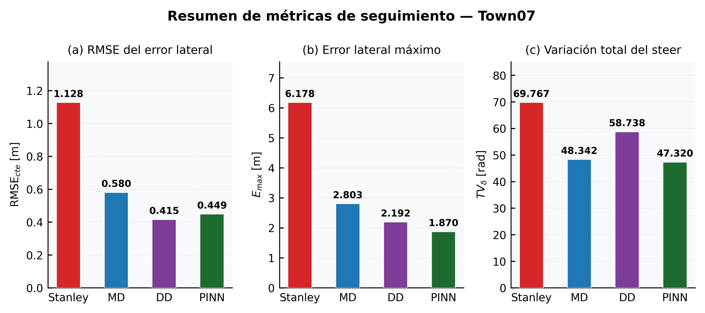
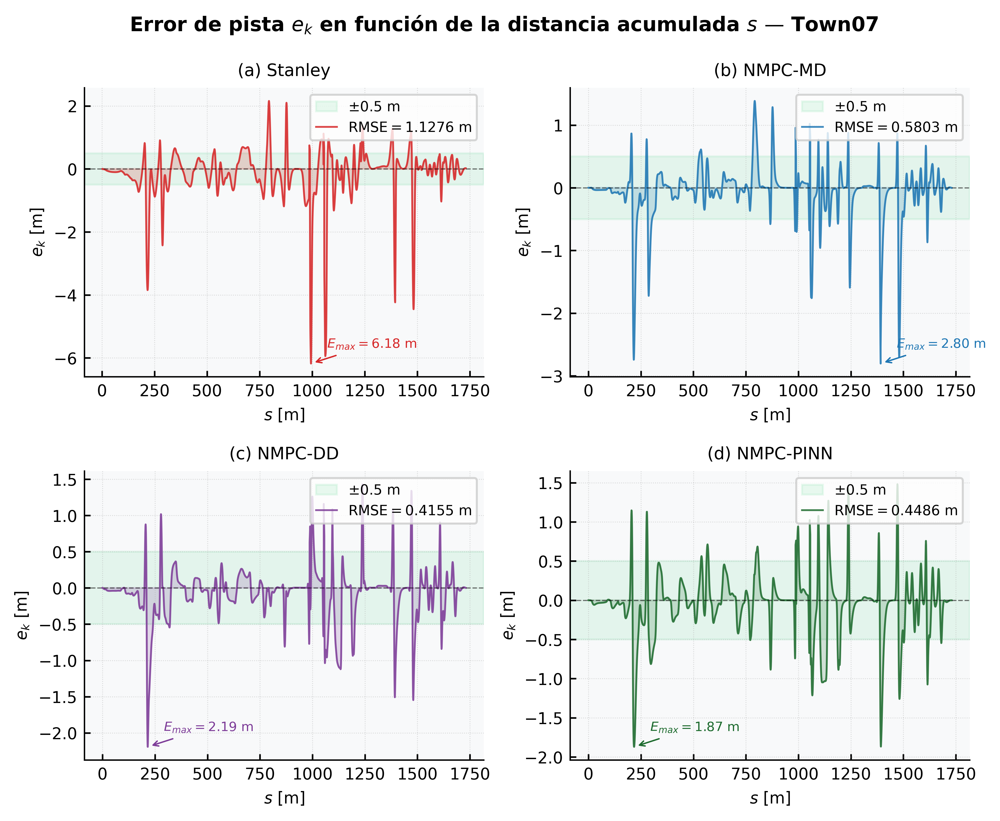
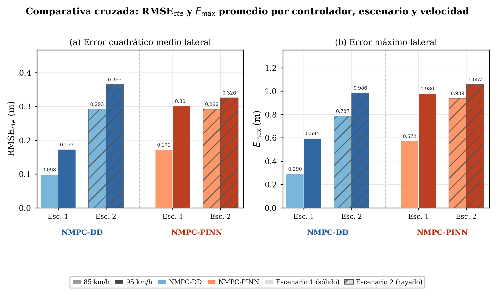

<div align="center">

# Control lateral de un vehículo autónomo en maniobras de evasión
### Comparación Stanley · NMPC-MD · NMPC-DD · NMPC-PINN en CARLA 0.9.16


</div>

Código y resultados finales de la tesis de maestría **"Diseño de un Sistema de Control para un
Vehículo Móvil en Maniobras de Evasión de Obstáculos en Escenarios de Emergencia"**
(Maestría en Control y Automatización, PUCP), validados en el simulador
[CARLA](https://carla.org/) 0.9.16 sobre un modelo identificado del bus Fusorosa
(m = 4800 kg, l_f = 3.018 m, l_r = 2.612 m, I_z = 21000 kg·m²).

Este repositorio contiene **solo los resultados finales de validación (Capítulo 4)**: cuatro
controladores laterales comparados en condiciones idénticas, más un análisis de sensibilidad
(masa / fricción / velocidad) que evidencia la capacidad de generalización de cada uno. No
incluye el desarrollo de modelado (Cap. 2) ni el diseño/tuning de controladores (Cap. 3) —
ese proceso de investigación se mantiene en el repositorio de trabajo privado.

---

## Controladores comparados

| # | Controlador | Descripción |
|---|---|---|
| 1 | **Stanley** | Ley de control geométrica con feedforward de curvatura |
| 2 | **NMPC-MD** | NMPC con modelo dinámico (bicicleta 5-DoF, parámetros identificados del Fusorosa) |
| 3 | **NMPC-DD** | NMPC con modelo *data-driven* (MLP), linealizado numéricamente fuera de CasADi |
| 4 | **NMPC-PINN** | NMPC con modelo *physics-informed* (MLP + restricciones físicas) |

## Resultado principal — Town07 (ruta no vista en entrenamiento)

<div align="center">

</div>

| Controlador | RMSE_cte [m] | MAE_cte [m] | E_max [m] | TV_δ [rad] |
|---|---|---|---|---|
| Stanley | 1.128 | 0.589 | 6.178 | 69.77 |
| NMPC-MD | 0.580 | 0.300 | 2.803 | 48.34 |
| NMPC-DD | **0.416** | 0.244 | 2.192 | 58.74 |
| NMPC-PINN | 0.449 | 0.276 | 1.871 | 47.32 |

<div align="center">

</div>

*(Ver [`resultados/06_comparacion_final_town07`](resultados/06_comparacion_final_town07) para el notebook y las figuras completas.)*

## Hallazgo clave — generalización ante condiciones no vistas

En la ruta nominal de Town07, NMPC-DD y NMPC-PINN rinden de forma muy similar. La diferencia
aparece en el **análisis de sensibilidad** (masa, coeficiente de fricción, velocidad de crucero —
[`resultados/07_escenarios_sensibilidad`](resultados/07_escenarios_sensibilidad)):

<div align="center">

</div>

El modelo DD, al ser puramente estadístico, **diverge en combinaciones fuera de su distribución
de entrenamiento** (ver los casos `*_fail.npy` en `07_escenarios_sensibilidad/`), mientras que
**NMPC-PINN se mantiene estable en todos los escenarios evaluados** gracias a las restricciones
físicas incorporadas durante el entrenamiento. Esa es la evidencia cuantitativa de generalización
que sostiene la conclusión principal de la tesis.

## Evidencia en video

Grabaciones de las corridas en CARLA de los 4 controladores en Town07, más las variantes de
escenario (Esc. 1/2) y la versión con estimación de estado (PINN-EKF):

📁 **[Carpeta de videos (Google Drive)](https://drive.google.com/drive/folders/1M352pA8DdquowHwVZXGbhakHKtNLHEvh?usp=drive_link)**

| Video | Controlador |
|---|---|
| `controladorStanley_Tesis_V1.mp4` | Stanley — Town07 |
| `controladorNMPC-MD_Tesis_V2.mp4` | NMPC-MD — Town07 |
| `controladorNMPC-DD_Tesis_V3.mp4` | NMPC-DD — Town07 |
| `controladorNMPC-PINN_Tesis_V4.mp4` | NMPC-PINN — Town07 |
| `NMPC-*_Escenario1_V5-V8.mp4` | DD/PINN — barrido de sensibilidad, escenario 1 |
| `NMPC-*-Escenario2_V9-V12.mp4` | DD/PINN — barrido de sensibilidad, escenario 2 |
| `NMPC-PINN_V13.mp4` / `NMPC-PINN-EKF_V14.mp4` | PINN sin/con estimación de estado (EKF) |

> No se subieron al repositorio: son ~475 MB en total y dos archivos superan el límite de 100 MB
> por archivo de GitHub. Si en algún momento se prioriza tener una copia con DOI permanente
> (en vez de depender de una cuenta de Drive personal), estos videos son candidatos naturales
> para subir a [Zenodo](https://zenodo.org/) junto con los `.npy`/`.keras` pesados.

---

## Estructura

```
repo/
├── assets/                          # figuras del README
├── common/                          # copia de referencia de las utilidades del cliente CARLA
├── data/                            # copia de referencia del dataset de ruta Town07
└── resultados/
    ├── 01_stanley_town07/
    ├── 02_nmpc_dinamico_town07/
    ├── 03_nmpc_datadriven_town07/
    ├── 04_nmpc_pinn_town07/
    ├── 05_nmpc_pinn_town07_ekf/      # variante con estimación de estado (EKF) — análisis de robustez
    ├── 06_comparacion_final_town07/  # comparación de los 4 controladores + figuras finales
    └── 07_escenarios_sensibilidad/   # barrido masa/μ/velocidad en Town04-Esc.2 y Town06-Esc.1
        ├── figuras/                  # figuras finales (comparativas + sensibilidad, .png/.pdf)
        └── *.ipynb, *.npy            # notebooks de análisis y datos del barrido
```

Cada carpeta `01`–`05` es **autocontenida**: trae su propio script de control (`.py`), las
utilidades del cliente CARLA (`HUD.py`, `World.py`, etc.), el dataset de ruta
(`traj_dataset_Town07.npy`), el notebook de análisis (`.ipynb`, con las figuras ya generadas
como salida embebida), los datos finales de la corrida (`.npy`) y, cuando aplica, el modelo
entrenado (`models/*.keras` + `scalers*.pkl`). Las copias en `common/` y `data/` son solo de
referencia para no tener que abrir cinco carpetas para ver el mismo archivo.

## Reproducir localmente

1. Instalar CARLA 0.9.16 y correr el servidor (nativo o con la imagen oficial `carlasim/carla`).
2. Crear el entorno del cliente Python:
   ```bash
   pip install -r requirements.txt
   ```
   El paquete `carla` no está en PyPI: se instala desde el wheel oficial que trae la
   distribución de CARLA 0.9.16 en `PythonAPI/carla/dist/` (ej. `carla-0.9.16-cp312-cp312-win_amd64.whl`
   para Python 3.12 en Windows — usa el wheel que corresponda a tu versión de Python/SO).
3. Entrar a la carpeta del resultado que quieras correr (ej. `resultados/04_nmpc_pinn_town07`)
   y ejecutar el script de control (`python NMPCPINN_Final_Town07.py`) con el servidor CARLA activo.
   No hace falta copiar nada más: cada carpeta ya trae todo lo que sus scripts necesitan.
4. Para ver el análisis sin correr CARLA, basta con abrir el `.ipynb` correspondiente — ya
   contiene las figuras generadas como salida guardada.

> Los `.npy` de resultados y los `.keras` de los modelos son binarios medianos (repo completo
> ≈140 MB, sobre todo por `07_escenarios_sensibilidad`). Si vas a versionar esto en GitHub,
> considera [Git LFS](https://git-lfs.github.com/) para los `.npy`/`.keras` (no para `assets/`,
> que debe quedar en git normal para que el README se vea sin descargar nada), o archivar todo
> en [Zenodo](https://zenodo.org/) con un DOI citable desde la tesis.

## Licencia

MIT — ver [`LICENSE`](LICENSE).

## Cita

Si usas este código, cita la tesis:

> Segovia Razo, A. F. (2026). *Diseño de un Sistema de Control para un Vehículo Móvil en
> Maniobras de Evasión de Obstáculos en Escenarios de Emergencia*. Tesis de maestría,
> Maestría en Control y Automatización, Pontificia Universidad Católica del Perú.
